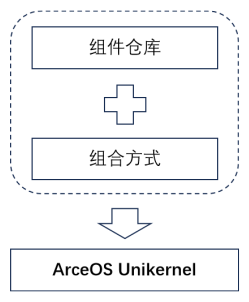
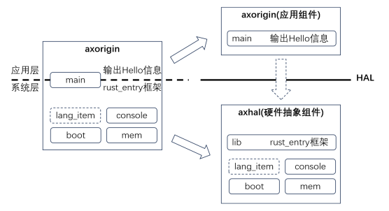
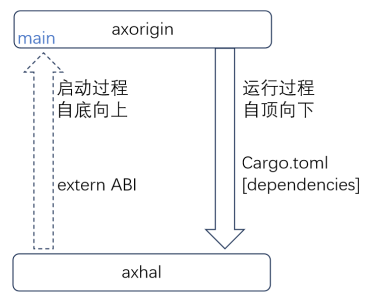

## 第三节 应用组件与硬件抽象组件

从本节开始，我们将开启组件化构造操作系统内核的旅程。

与传统构造内核的方法不同，组件化构造内核包括两个部分：一是建立一个组件仓库，其中的组件都具有高度可复用性；二是建立一种管理、选择和组合组件的方法与机制。在二者的基础上，我们就可以根据需要，基于组件组合的方式快速定制生产目标内核。

<div style="text-align:center">
   
</div>


本节的实验，我们就对应上面所述的两个部分，分两个步骤进行。

**第一步：对当前版本的单一内核进行分解，形成最初的组件仓库。**

<div style="text-align:center">
   
</div>


当前内核虽然是 Unikernel 形态，按照功能仍然可以分成系统和应用两层。

- **系统层**：迄今为止，我们进行的大部分工作都可以归纳到系统层，大多是针对硬件平台的操作，包括启动模块 boot，控制台模块 console，内存模块 mem 等。这些模块的共同特点：对外提供一个抽象的硬件操作接口，内部则封装了针对 RiscV 体系结构和具体硬件的操作。我们希望把上述接口明确固定下来，形成一个稳定的**硬件抽象层 Hardware Abstract Layer**（简称 HAL）。以 HAL 分界，可以实现上下层组件的解耦。方便我们将来对其它体系结构及平台的支持工作。
- **应用层**：目前应用层的工作仅仅是调用 console，向屏幕输出 Hello 信息。注意：我们要把 rust_entry 框架和清零 BSS 分离出去，因为那些属于系统层的功能。

基于这样的层次划分，我们就建立起最初的两个组件 axhal 和 axorigin。其中 axorigin 继承了原始内核工程的名字，但它的身份已经降级成为一个应用组件，将来必须与 axhal 等系统组件配合来构成完整的 Unikernel 内核。

- **axhal 组件**

  - 封装系统层的所有模块，从外形看，它是一个 lib 形式的 crate。但是从启动角度，由于它的 boot 模块包含了内核的 _start 入口，其实是首先运行的，然后才会去启动应用组件。

  - 在工作目录 arceos 中，通过 `cargo new axhal --lib` 建立 axhal 工程。将上一版本内核的模块文件 lang_items.rs、boot.rs、mem.rs、console.rs 挪到 axhal 的 src 目录下。看一下 axhal 的根模块 lib.rs：
  
    ```rust,editable
    #![no_std]
    #![feature(asm_const)]
    
    mod lang_items;
    mod boot;
    mod mem;
    pub mod console;
    
    unsafe extern "C" fn rust_entry(hartid: usize, dtb: usize) {
        extern "C" {
            fn main(hartid: usize, dtb: usize);
        }
        mem::clear_bss();
        main(hartid, dtb);
    }
    ```
  
  - 修改一下 axhal 的 Cargo.toml，引入对 sbi-rt 的依赖：
  
    ```rust,editable
    [dependencies]
    sbi-rt = { version = "0.0.2", features = ["legacy"] }
    ```
  
  - 组件 axhal 继承了上一版本内核几乎所有的模块，以及 rust_entry 框架，只是把直接调用 console 进行打印的那行代码，替换成一个外部函数 main，这个 main 函数就是应用组件的入口。这里可能会产生一个疑问，为什么需要通过 extern ABI 这种外部函数的形式去调用？而不能以引入依赖 crate 的方式去调用？后面会说明这一原因。


- **axorigin 组件**

  - 前面提到了，这个组件只是继承了原来内核工程的名字，目前已经退化成一个应用组件。与组件 axhal 相应的，从外部看，axorigin 具有 main.rs 根模块，形式上就是一个 binary crate；但是它自身是无法运行的，需要等待 axhal 组件启动它。


  - 来看一下 axorigin 当前的 main.rs 实现：

    - ```rust, editable
      #![no_std]
      #![no_main]
      
      #[no_mangle]
      pub fn main(_hartid: usize, _dtb: usize) {
          axhal::console::write_bytes(b"\nHello, ArceOS!\n");
      }
      ```


    - 主体就是一个 main 函数，正对应 axhal 组件在最后阶段要调用的函数，main 是所有应用类型组件的入口。

    - > <font size=2>这个 main，与我们基于 Linux/Windows 平台进行应用编程时写的 main，其实并无关系，上面 `#[no_main]` 已经说明了这一点。这里起这个名字，只是为了适应编程习惯。</font>

  - 目前，应用组件 axorigin 在 main 函数中要实现的逻辑非常简单，但是它为我们建立了基本的 Unikernel 应用框架；将来在开发 Unikernel 应用时，只需要创建一个应用组件，并在 main 函数中填充我们要实现的业务逻辑即可。应用逻辑开发与系统功能的实现从此分离。


**第二步：对现有的两个组件进行组合，形成可以运行的内核。**

既然两个组件都是 Rust crate 的形式，最简单的组合方式，自然就是利用 Cargo 工具提供的 denpendencies 依赖机制进行连接组合。

来看 axorigin 的 Cargo.toml：

```rust,editable
[dependencies]
axhal = { path = "../axhal" }
```

Rust 工具链中的 Cargo，就可以自动为我们进行组件的组合，并构造出内核。

另外，linker.lds 实际也是与体系结构相关的，把它挪到 axhal 的目录下，注意改一下 Makefile：

```makefile
LD_SCRIPT := $(CURDIR)/axhal/linker.lds
```

用 `git show --stat` 比较当前基于组件化的版本与上一版本在代码方面的变化：

```bash
 axorigin/Cargo.toml                   |  2 +-
 axorigin/src/main.rs                  | 12 +++---------
 {axorigin => axhal}/src/boot.rs       |  0
 {axorigin => axhal}/src/console.rs    |  0
 {axorigin => axhal}/src/lang_items.rs |  0
 {axorigin => axhal}/src/mem.rs        |  0
 linker.lds => axhal/linker.lds        |  0
 axhal/Cargo.toml                      |  7 +++++++
 axhal/src/lib.rs                      | 17 +++++++++++++++++
 8 files changed, 28 insertions(+), 10 deletions(-)
```

运行 `make run` 测试我们第一个组件化方式构造的内核，屏幕输出正常。

最后，解释一下之前的问题：为什么在启动过程中，组件 axhal 必须通过 extern ABI 的方式调用组件 axorigin 的 main 函数。

<div style="text-align:center">
   
</div>


从图中可以看到，两个组件之间存在相互调用的关系，启动过程中 axhal 调用 axorigin 的 main 函数；运行过程中 axorigin 作为应用需要调用系统组件 axhal 的各种功能。既然 axorigin 已经通过 Cargo.toml 对 axhal 建立了依赖，那么另一个方向的依赖就不成立了，否则就会导致**循环依赖**。因此只好在启动过程中，采用 extern ABI 的方式调用 main 函数。

在我们将来构造内核的实验中，循环依赖将会是一个比较麻烦的问题。在第三章里，将会引入一个特殊的组件 crate_interface 用于专门处理循环依赖，本质上它仍然是基于 extern ABI，但是基于该组件提供了一种 Rusty 风格的调用方式，代码的可读性更好，同时可以有效减少编程出错的概率。
